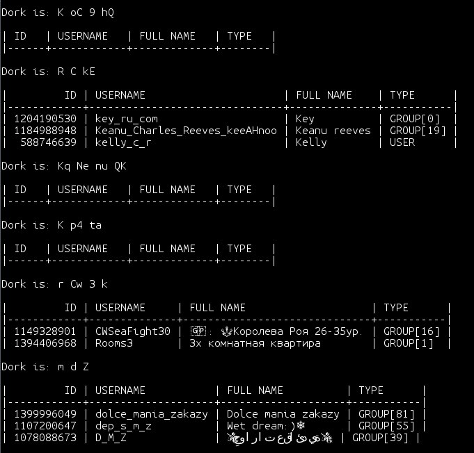

## Telegram weird results search

Run global search in Telegram to find some weird results!

Random dork -> 3 results -> checking for strange overlaps of words.



### Setup

0. Install dependencies:
```sh
pip3 install -r requirements.txt
```
1. Get `api_id` and `api_hash` following the [official guide](https://core.telegram.org/api/obtaining_api_id)
2. Edit default values in `run_search.py`:
```sh
api_id = 0
api_hash = 'hash'
```
3. Run with session argument and login following the instructions:
```sh
./run_search.py my.session --check
```

### Modes

`--random` -- search by N random dorks (define N througth `--count`), default wait time -- 5 sec

`--dork 'a b c'` -- search by dork 'a b c'

`--check` -- search and assert by hardcoded special dorks